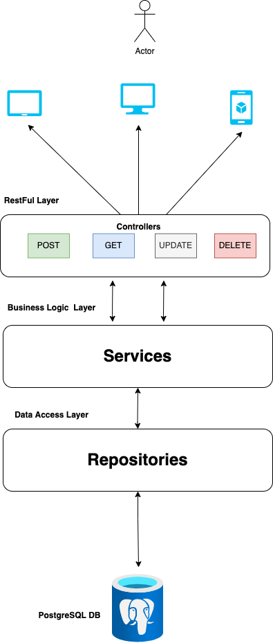

# Spring Boot Beginner class
This is a Spring Boot beginner class where I teach you how to get started with building Rest API's with java 8+ and Spring

## Architecture

## Tech Stack
> `Java 11` 
> `Springboot 2` 
>`Spring Data JPA`
> `PostgreSQL`

## Summary

This course teaches you how to how to build a complete CRUD rest api with Spring Boot from ground upand focuses on very important concepts used in real life software engineering projects. These include:

- Spring Boot Backend API
- Maven Build Tool
- Database connection using PostgreSQL
- Spring Data JPA
- Jar Packaging of your API
- Unit and Integration Testing
- Best practices ofr folder structure

